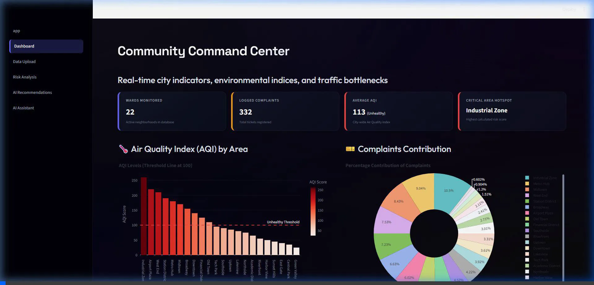
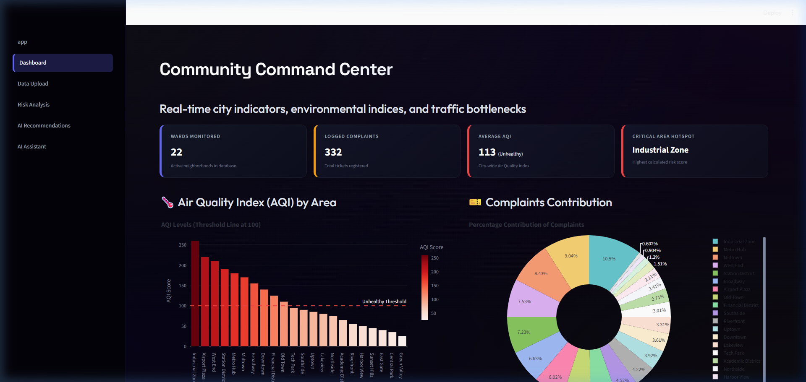
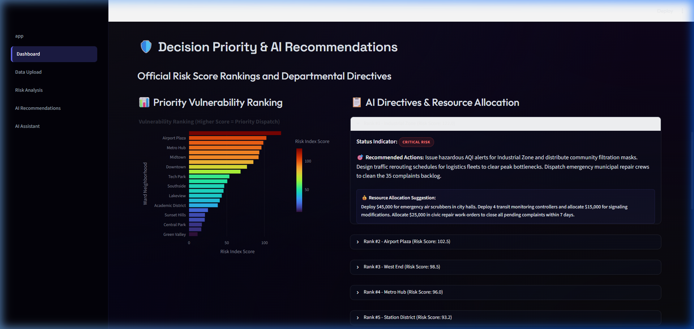
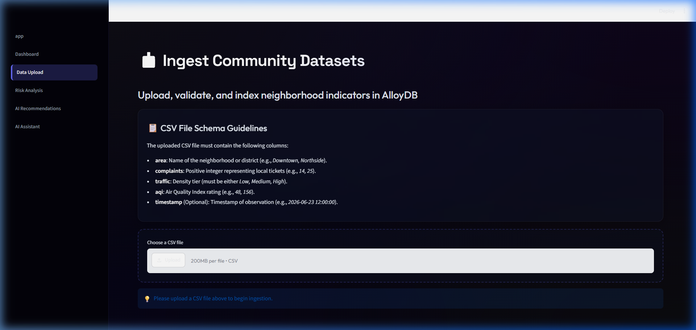

### Live Demo

Explore the deployed application here:
https://romalearner-community-ai.hf.space/

This demo showcases the Community Decision Intelligence Platform (CDIP) and its key features.

# 🏙️ Community Decision Intelligence Platform (CDIP)

> **Empowering Local Leadership with AI-Driven Decision Insights**

Community Decision Intelligence Platform (CDIP) is an AI-powered decision support system that helps municipalities and local governments transform public datasets into actionable insights. By combining interactive dashboards, predictive risk analysis, and Generative AI, the platform enables data-driven policy planning and resource prioritization.

---

## 📌 Overview

CDIP enables administrators to upload community datasets, analyze key indicators such as complaints, traffic density, and air quality, and receive AI-generated recommendations for informed decision-making.

The platform consists of a **FastAPI backend**, a **Streamlit frontend**, an **SQLite database**, and **Google Gemini** for contextual AI assistance.

---

## ✨ Features

### 📊 Interactive Dashboard

- Real-time community overview
- Risk summary and key metrics
- Historical trend visualization
- Decision intelligence dashboard

---

### 📂 CSV Data Upload

Upload community datasets for analysis.

Supported capabilities include:

- CSV validation
- Duplicate filtering
- Data preprocessing
- Database storage
- Upload status reporting

Example dataset fields:

- Area
- Population
- Complaints
- Traffic Density
- Air Quality Index (AQI)

---

### ⚠️ Predictive Risk Analysis

Automatically evaluates uploaded datasets to identify:

- High-risk communities
- Complaint hotspots
- Traffic congestion
- Environmental concerns
- Overall community risk score

---

### 🤖 AI Recommendations

Using **Google Gemini**, the platform generates:

- Community improvement suggestions
- Risk mitigation strategies
- Resource prioritization
- Policy recommendations
- Executive summaries

---

### 💬 AI Assistant

An interactive assistant capable of answering contextual questions such as:

- Which communities require immediate attention?
- Why is an area classified as high risk?
- Summarize uploaded data.
- Recommend policy actions.
- Generate management reports.

---

# 🏗️ System Architecture

```text
                    +-----------------------+
                    |   Streamlit Frontend  |
                    +-----------+-----------+
                                |
                                |
                    REST API Requests
                                |
                                ▼
                    +-----------------------+
                    |    FastAPI Backend    |
                    +-----------+-----------+
                                |
          +---------------------+---------------------+
          |                     |                     |
          ▼                     ▼                     ▼
   CSV Processing         SQLite Database      Gemini AI Service
          |                     |                     |
          +---------------------+---------------------+
                                |
                                ▼
                  Risk Analysis & AI Recommendations
                                |
                                ▼
                        Interactive Dashboard
```

---

# 📁 Repository Structure

```text
community-decision-AI/
│
├── backend/
│   ├── app/
│   │   ├── routers/
│   │   ├── services/
│   │   └── main.py
│   │
│   ├── database/
│   │   ├── connection.py
│   │   ├── crud.py
│   │   ├── csv_processor.py
│   │   ├── models.py
│   │   ├── schemas.py
│   │   ├── schema.sql
│   │   └── migration_v1.sql
│   │
│   ├── community.db
│   └── test_upload_integration.py
│
├── frontend/
│   ├── pages/
│   ├── app.py
│   ├── config.py
│   └── styles.css
│
├── Dockerfile
├── requirements.txt
├── startup.sh
├── sample_data.csv
├── package.json
├── README.md
└── LICENSE
```

---

# 🛠 Technology Stack

| Category | Technology |
|-----------|------------|
| Frontend | Streamlit |
| Backend | FastAPI |
| Database | SQLite |
| AI | Google Gemini |
| Language | Python |
| Data Processing | Pandas |
| API Validation | Pydantic |
| Deployment | Docker |
| Version Control | Git & GitHub |

---

# 🚀 Getting Started

## Prerequisites

- Python 3.10+
- Git
- Google Gemini API Key

---

## Clone the Repository

```bash
git clone https://github.com/roma2020-app/community-decision-AI.git

cd community-decision-AI
```

---

## Create a Virtual Environment

### Windows

```bash
python -m venv venv

venv\Scripts\activate
```

### Linux/macOS

```bash
python3 -m venv venv

source venv/bin/activate
```

---

## Install Dependencies

```bash
pip install -r requirements.txt
```

---

## Configure Environment Variables

Create a `.env` file:

```env
GEMINI_API_KEY=YOUR_API_KEY
```

---

## Run Backend

```bash
cd backend

uvicorn app.main:app --reload
```

Backend will start at:

```
http://localhost:8000
```

---

## Run Frontend

Open another terminal.

```bash
cd frontend

streamlit run app.py
```

Frontend:

```
http://localhost:8501
```

---

# 📊 Workflow

```text
Upload CSV
     │
     ▼
Validate Dataset
     │
     ▼
Store in SQLite
     │
     ▼
Risk Analysis
     │
     ▼
AI Recommendation
     │
     ▼
Dashboard & Reports
     │
     ▼
Interactive AI Assistant
```

---

# 📷 Application Modules

- Dashboard
- Data Upload
- Risk Analysis
- AI Recommendations
- AI Assistant

---
## 📸 Screenshots & Interactive Demo

Here is a visual showcase of the Community Decision Intelligence Platform (CDIP) running with the full 22-ward dataset and readability fixes:

### 1. Interactive Demo Walkthrough
Below is the recorded walkthrough of the browser verification, demonstrating the upload pipeline, dashboard KPIs, and expandable recommendations:


### 2. Main Dashboard Command Center
The landing panel displaying overall city indicators, average AQI status, complaints share, and the dynamically calculated **Critical Area Hotspot**:


### 3. Priority Vulnerability Rankings & Decision Directives
The horizontal risk score chart sorting all 22 wards, alongside the expanded AI-generated Recommended Actions and Resource Allocations:


### 4. Data Ingestion & In-Memory Duplicate Check Interface
The CSV drag-and-drop ingestion interface, rendering the high-contrast sidebar page navigation links clearly:


---
# 📈 Example Use Cases

- Smart City Governance
- Municipal Planning
- Public Safety Monitoring
- Infrastructure Prioritization
- Environmental Monitoring
- Complaint Analysis
- Resource Allocation
- Executive Decision Support

---

# 🔒 Explainable AI

CDIP promotes transparent AI-assisted decision-making by generating recommendations based on uploaded datasets and providing contextual explanations through the AI Assistant. This helps decision-makers understand the reasoning behind suggested actions while maintaining human oversight.

---

# 📦 Deployment

The project can be deployed using:

- Docker
- Hugging Face Spaces
- Render
- Railway
- Azure App Service
- Google Cloud Run

---

# 🔮 Future Enhancements

- GIS-based community mapping
- Real-time IoT data integration
- Live government data APIs
- Predictive analytics dashboard
- Automated report generation (PDF/Excel)
- Role-based authentication
- Multi-language support
- Mobile application

---

# 📄 License

This project is licensed under the **MIT License**.

---

# 👩‍💻 Author

**Roma Gupta**

AI Engineer | Python Developer | Generative AI & Decision Intelligence Enthusiast

GitHub: https://github.com/roma2020-app

---

## ⭐ Support

If you found this project useful, consider giving it a **⭐ Star** on GitHub to support its development.
---


## 📄 License
This project is licensed under the MIT License - see the LICENSE file for details.
